# Loop Media — Data Model

Source of truth: [`supabase/migrations/0001_init.sql`](../supabase/migrations/0001_init.sql).
TypeScript mirror: [`lib/db.types.ts`](../lib/db.types.ts). This Mermaid diagram renders on GitHub
and in VS Code (with a Mermaid extension).

```mermaid
erDiagram
  TERRITORIES ||--o{ TERRITORIES : "parent of"
  TERRITORIES ||--o{ PROFILES : "scopes"
  TERRITORIES ||--o{ VENUES : "has"
  TERRITORIES ||--o{ CATEGORY_CAPS : "sets caps"
  TERRITORIES ||--o{ PACKAGES : "scopes"
  TERRITORIES ||--o{ PACKAGE_TERRITORY_PRICES : "price override"
  TERRITORIES ||--o{ ADS : "scopes"
  TERRITORIES ||--o{ CAMPAIGNS : "scopes"
  TERRITORIES ||--o{ SUBSCRIPTIONS : "scopes"
  TERRITORIES ||--o{ FILLER_CONTENT : "has"

  CATEGORIES ||--o{ CATEGORY_CAPS : "capped"
  CATEGORIES ||--o{ VENUES : "types"
  CATEGORIES ||--o{ ADS : "categorizes"

  PROFILES ||--o{ VENUES : "hosts"
  PROFILES ||--o{ ADS : "owns"
  PROFILES ||--o{ CREATIVE_REQUESTS : "submits"
  PROFILES ||--o{ CAMPAIGNS : "runs"
  PROFILES ||--o{ SUBSCRIPTIONS : "billed"

  VENUES ||--o{ TVS : "has"
  VENUES ||--o{ ADS : "host promo for"

  ADS ||--o{ CAMPAIGNS : "promoted by"
  ADS ||--o{ AD_PLACEMENTS : "placed as"
  ADS ||--o{ QR_SCANS : "scanned"

  PACKAGES ||--o{ PACKAGE_TERRITORY_PRICES : "priced per city"
  PACKAGES ||--o{ CAMPAIGNS : "tier"
  PACKAGES ||--o{ SUBSCRIPTIONS : "tier"

  CAMPAIGNS ||--o{ SUBSCRIPTIONS : "billed via"
  CAMPAIGNS ||--o{ AD_PLACEMENTS : "fills"

  TVS ||--o{ AD_PLACEMENTS : "shows"
  TVS ||--o{ QR_SCANS : "from"

  TERRITORIES {
    uuid id PK
    text name
    text slug
    uuid parent_id FK
    bool is_holding
    enum status
  }
  PROFILES {
    uuid id PK
    text email
    enum role
    uuid territory_id FK
  }
  CATEGORIES {
    uuid id PK
    text name
    text slug
  }
  CATEGORY_CAPS {
    uuid id PK
    uuid territory_id FK
    uuid category_id FK
    int max_advertisers
  }
  VENUES {
    uuid id PK
    uuid territory_id FK
    uuid category_id FK
    uuid host_user_id FK
    text name
    numeric lat
    numeric lng
    int foot_traffic_estimate
    enum status
  }
  TVS {
    uuid id PK
    uuid venue_id FK
    text device_id
    text pairing_code
    enum status
    int loop_length_seconds
  }
  ADS {
    uuid id PK
    uuid owner_user_id FK
    enum owner_kind
    uuid territory_id FK
    uuid category_id FK
    uuid host_venue_id FK
    enum creative_type
    enum status
    text qr_target_url
  }
  CREATIVE_REQUESTS {
    uuid id PK
    uuid advertiser_id FK
    text brief
    enum status
  }
  PACKAGES {
    uuid id PK
    enum tier
    int screen_cap
    int target_impressions
    int base_price_cents
    uuid territory_id FK
  }
  PACKAGE_TERRITORY_PRICES {
    uuid id PK
    uuid package_id FK
    uuid territory_id FK
    int price_cents
  }
  CAMPAIGNS {
    uuid id PK
    uuid advertiser_id FK
    uuid ad_id FK
    uuid package_id FK
    uuid territory_id FK
    int target_impressions
    enum status
  }
  SUBSCRIPTIONS {
    uuid id PK
    uuid advertiser_id FK
    uuid campaign_id FK
    uuid package_id FK
    text stripe_subscription_id
    enum status
  }
  AD_PLACEMENTS {
    uuid id PK
    uuid ad_id FK
    uuid tv_id FK
    uuid campaign_id FK
    int slot_position
    enum status
  }
  QR_SCANS {
    uuid id PK
    uuid ad_id FK
    uuid tv_id FK
    timestamptz scanned_at
  }
  FILLER_CONTENT {
    uuid id PK
    uuid territory_id FK
    enum type
    jsonb payload
    bool active
  }
```

## How to read the flows

- **Tenancy:** `TERRITORIES` is the spine — Holdings is the parent row, each city is a child. Almost
  every table carries a `territory_id` so a city admin sees only their world.
- **Inventory:** `VENUES` (physical locations) each have one or more `TVS`. A venue's `category_id`
  drives **exact-match exclusivity**.
- **Advertiser path:** `PROFILES` (advertiser) → `ADS` (creative + approval) → `CAMPAIGNS` (the
  traffic goal) → `SUBSCRIPTIONS` (Stripe billing). The engine reads a campaign and writes
  `AD_PLACEMENTS` (ad × TV × slot).
- **Host path:** a host `PROFILE` `hosts` a `VENUE` and owns up to 3 `ADS` (`owner_kind = host`).
- **Analytics:** `QR_SCANS` (ad × TV) and impression estimates derived from `AD_PLACEMENTS` +
  venue foot traffic. `FILLER_CONTENT` fills the gaps between paid slots on the TV loop.
